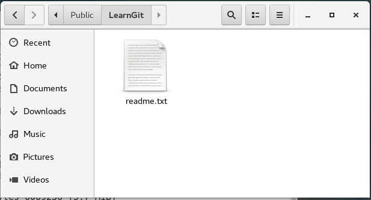
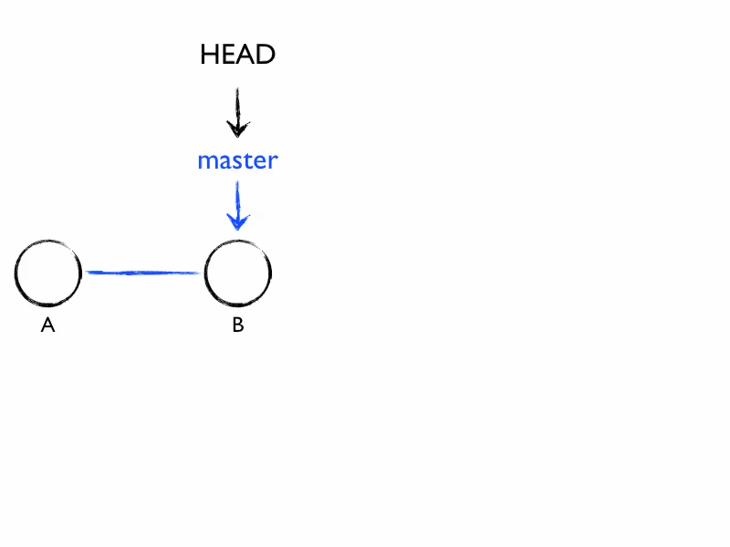
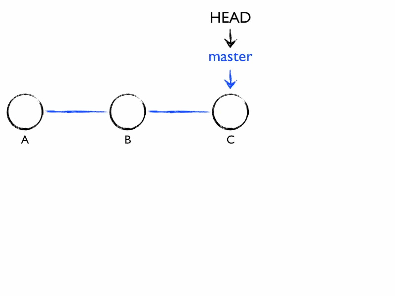

# Git NoteBook [REF](https://www.liaoxuefeng.com/wiki/0013739516305929606dd18361248578c67b8067c8c017b000)

初始化一个Git仓库，使用 `git init`命令。

添加文件到Git仓库，分两步：

* 使用命令 `git add <file>`，注意，可反复多次使用，添加多个文件；
* 使用命令 `git commit -m <message>`，完成。

---

#### 版本回退

`git log`命令显示从最近到最远的提交日志。
>如果嫌输出信息太多，看得眼花缭乱的，可以试试加上`--pretty=oneline`参数(`git log --pretty=oneline`)

```txt
b60bdcf7c6c593a89cb0b54fa2bad9d531730d00 append GPL
97c4a9863129d4239ccbff69be173b091ffca0c4 wrote a readme file
```

commit id(版本号)|comment（注释）
------------------|------------|
b60bdcf7c6c593a89cb0b54fa2bad9d531730d00|append GPL
97c4a9863129d4239ccbff69be173b091ffca0c4|wrote a readme file

>`commit id`一个SHA1计算出来的一个非常大的数字，用十六进制表示

Git必须知道当前版本是哪个版本，在Git中，用**HEAD**表示当前版本，也就是最新的提交，上一个版本就是**HEAD^**，上上一个版本就是**HEAD^^**，当然往上100个版本写100个^比较容易数不过来，所以写成**HEAD~100**。

回退到上一个版本，使用`git reset`命令
>`git reset --hard HEAD^`

指定回到未来的某个版本,`git reset --hard {commit id}`
>`git reset --hard b60bdc`</br>
>版本号(commit id)没必要写全，前几位就可以了,也不可太少，要不然git找不到</br>
>Git的版本回退速度非常快，因为Git在内部有个指向当前版本的HEAD指针，当你回退版本的时候，Git仅仅是把HEAD指向你要回退的那个版本。

Git提供了一个命令`git reflog`用来记录你的每一次命令.(找不到commit id的时候可以根据这个找)

---

#### 工作区与暂存区

工作区（*Working Directory*）:在电脑里能看到的目录,比如下图的`LearnGit`



版本库（*Repository*）:
工作区有一个隐藏目录.git，这个不算工作区，而是Git的版本库。


> Git的版本库里存了很多东西，其中最重要的就是称为stage（或者叫index）的暂存区，还有Git为我们自动创建的第一个分支`master`，以及指向`master`的一个指针叫`HEAD`

把文件往Git版本库里添加的时候，是分两步执行的：
>第一步是用`git add`把文件添加进去，实际上就是把文件修改添加到暂存区</br>
第二步是用`git commit`提交更改，实际上就是把暂存区的所有内容提交到当前分支。

通过`git status`查看git的当前状态


---

#### 管理修改

Git跟踪并管理的是修改，而非文件;

当你用`git add`命令后，在工作区的第一次修改被放入暂存区，准备提交，但是，在工作区的第二次修改并没有放入暂存区，所以，`git commit`只负责把暂存区的修改提交

`git diff HEAD -- readme.txt`命令可以查看**工作区**和**版本库**里面最新版本的区别

每次修改，如果不用git add到暂存区，那就不会加入到commit中

---

#### 撤销修改

`git checkout -- file`可以丢弃工作区的修改

>`git checkout -- readme.txt`意思就是，把`readme.txt`文件在工作区的修改全部撤销，这里有两种情况：</br>
一种是`readme.txt`自修改后还没有被放到暂存区，现在，撤销修改就回到和版本库一模一样的状态；</br>
一种是`readme.txt`已经添加到暂存区后，又作了修改，现在，撤销修改就回到添加到暂存区后的状态。</br>
总之，就是让这个文件回到最近一次`git commit`或`git add`时的状态。

命令`git reset HEAD <file>`可以把暂存区的修改撤销掉（unstage），重新放回工作区
>`git reset`命令既可以回退版本，也可以把暂存区的修改回退到工作区。当我们用HEAD时，表示最新的版本;`git checkout -- readme.txt`

--假设你不但改错了东西，还从暂存区提交到了版本库，怎么办呢？`git reset --hard b60bdc`。不过，这是有条件的，就是你还没有把自己的本地版本库推送到远程。还记得Git是分布式版本控制系统吗？我们后面会讲到远程版本库，一旦你把stupid boss提交推送到远程版本库，你就真的惨了……

---

#### 删除文件

>先手动删除文件，然后使用`git rm <file>`和`git add<file>`效果是一样的。

`git checkout`其实是用版本库里的版本替换工作区的版本，无论工作区是修改还是删除，都可以“一键还原”。ex：`git checkout -- test.txt`

命令`git rm`用于删除一个文件。如果一个文件已经被提交到**版本库**，那么你永远不用担心误删，但是要小心，你只能恢复文件到最新版本，你会丢失最近一次提交后你修改的内容。

---

### 远程仓库

Git是分布式版本控制系统，同一个Git仓库，可以分布到不同的机器上。一台机器有一个原始版本库，此后，别的机器可以“克隆”这个原始版本库，而且每台机器的版本库其实都是一样的，并没有主次之分。

由于你的`本地Git仓库`和`GitHub仓库`之间的传输是通过`SSH`加密的，所以，需要一点设置：

第1步：创建`SSH Key`。在用户主目录下，看看有没有`.ssh`目录，如果有，再看看这个目录下有没有`id_rsa`和`id_rsa.pub`这两个文件，如果已经有了，可直接跳到下一步。如果没有，打开`Shell（Windows下打开Git Bash）`，创建`SSH Key`：
>`ssh-keygen -t rsa -C "youremail@example.com"`

如果一切顺利的话，可以在用户主目录里找到`.ssh`目录，里面有`id_rsa`和`id_rsa.pub`两个文件，这两个就是`SSH Key`的秘钥对，`id_rsa`是私钥，不能泄露出去，`id_rsa.pub`是公钥，可以放心地告诉任何人。

第2步：登陆[GitHub](https://www.github.com)，打开`“Account settings”`，`“SSH Keys”`页面：

然后，点`“Add SSH Key”`，填上任意`Title`，在`Key文本框`里粘贴`id_rsa.pub`文件的内容：

用命令`git clone`克隆一个本地库: `git clone git@github.com:michaelliao/gitskills.git`

* 要克隆一个仓库，首先必须知道仓库的地址，然后使用`git clone`命令克隆。
Git支持多种协议，包括https，但通过ssh支持的原生git协议速度最快

---

### 分支管理

平行宇宙.

假设你准备开发一个新功能，但是需要两周才能完成，第一周你写了50%的代码，如果立刻提交，由于代码还没写完，不完整的代码库会导致别人不能干活了。如果等代码全部写完再一次提交，又存在丢失每天进度的巨大风险。

现在有了分支，就不用怕了。你创建了一个属于你自己的分支，别人看不到，还继续在原来的分支上正常工作，而你在自己的分支上干活，想提交就提交，直到开发完毕后，再一次性合并到原来的分支上，这样，既安全，又不影响别人工作。

#### 创建与合并分支

主分支`master`分支,`HEAD`严格来说不是指向提交，而是指向`master`，`master`才是指向提交的，所以，`HEAD`指向的就是当前分支。

一开始的时候，`master`分支是一条线，`Git`用`master`指向最新的提交，再用`HEAD`指向`master`，就能确定当前分支，以及当前分支的提交点：


每次提交，`master`分支都会向前移动一步，这样，随着你不断提交，`master`分支的线也越来越长：



当我们创建新的分支，例如`dev`时，`Git`新建了一个指针叫`dev`，指向`master`相同的提交，再把`HEAD`指向`dev`，就表示当前分支在`dev`上:


>`Git`创建一个分支很快，因为除了增加一个`dev`指针，改改`HEAD`的指向，工作区的文件都没有任何变化

从现在开始，对工作区的修改和提交就是针对`dev`分支了，比如新提交一次后，`dev`指针往前移动一步，而`master`指针不变


假如我们在`dev`上的工作完成了，就可以把`dev`合并到`master`上。`Git`怎么合并呢？最简单的方法，就是直接把`master`指向`dev`的当前提交，就完成了合并


>所以Git合并分支也很快！就改改指针，工作区内容也不变

合并完分支后，甚至可以删除`dev`分支。删除`dev`分支就是把`dev`指针给删掉，删掉后，我们就剩下了一条`master`分支




`git checkout`命令加上`-b`参数表示创建并切换,相当于以下两条命令

```git
git branch dev
git checkout dev
```

用`git branch`命令查看当前分支
>`git branch`命令会列出所有分支，当前分支前面会标一个`*`号

在`dev`分支上正常提交，比如对`readme.txt`做个修改，加上一行

```git
git add readme.txt
git commit -m "branch test"
```

`dev`分支的工作完成，我们就可以切换回`master`分支 : `git checkout master`


把`dev`分支的工作成果合并到`master`分支上 : `git merge dev`
>`git merge`命令用于合并指定分支到当前分支。

合并完成后，就可以放心地删除`dev`分支了 : `git branch -d dev`

    因为创建、合并和删除分支非常快，所以Git鼓励你使用分支完成某个任务，合并后再删掉分支，这和直接在`master`分支上工作效果是一样的，但过程更安全

Git鼓励大量使用分支：</br>
查看分支：`git branch` </br>
创建分支：`git branch <name>` </br>
切换分支：`git checkout <name>` </br>
创建+切换分支：`git checkout -b <name>` </br>
合并某分支到当前分支：`git merge <name>` </br>
删除分支：`git branch -d <name>` </br>

#### 解决冲突

合并分支的时候

* 创建新分支`git checkout -b feature1`,修改文件提交
* 切换到`master`分支`git checkout master`, 修改文件提交
* `master`分支和`feature1`分支各自都分别有新的提交

* 合并feature1分支`git merge feature1`
  >Auto-merging readme.txt </br>
CONFLICT (content): Merge conflict in readme.txt</br>
Automatic merge failed; fix conflicts and then commit the result.
* `readme.txt`文件存在冲突，必须手动解决冲突后再提交。`git status`可以查看冲突的文件：
  >  On branch master</br>
 You have unmerged paths.</br>
  (fix conflicts and run "git commit")</br>
</br>
 Unmerged paths:</br>
   (use "git add <file>..." to mark resolution)</br>
</br>
       both modified:      readme.txt</br>
no changes added to commit (use "git add" and/or "git commit -a")
