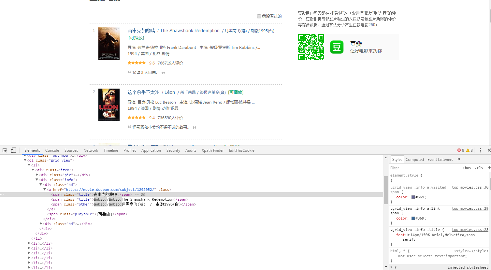
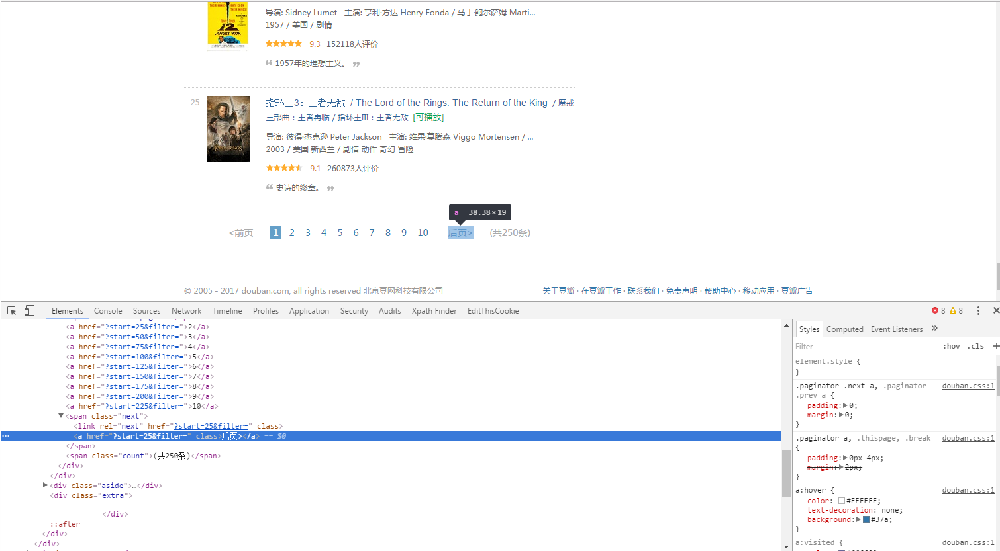

# scrapy爬虫框架

## 一. Scrapy入门 [**from**](https://woodenrobot.me/2017/01/01/scrapy%E7%88%AC%E8%99%AB%E6%A1%86%E6%9E%B6%E6%95%99%E7%A8%8B%EF%BC%88%E4%B8%80%EF%BC%89-Scrapy%E5%85%A5%E9%97%A8/])

### Scrapy简介

>Scrapy是一个为了爬取网站数据，提取结构性数据而编写的应用框架。 可以应用在包括数据挖掘，信息处理或存储历史数据等一系列的程序中。</br>
其最初是为了 页面抓取 (更确切来说, 网络抓取 )所设计的， 也可以应用在获取API所返回的数据(例如 Amazon Associates Web Services ) 或者通用的网络爬虫。

### 架构概览


### 各组件作用

#### Scrapy Engine

>引擎负责控制数据流在系统中所有组件中流动，并在相应动作发生时触发事件。 详细内容查看下面的数据流(Data Flow)部分。

此组件相当于爬虫的“大脑”，是整个爬虫的调度中心。

#### 调度器(Scheduler)

>调度器从引擎接受request并将他们入队，以便之后引擎请求他们时提供给引擎。

初始的爬取URL和后续在页面中获取的待爬取的URL将放入调度器中，等待爬取。同时调度器会自动去除重复的URL（如果特定的URL不需要去重也可以通过设置实现，如post请求的URL）

#### 下载器(Downloader)

>下载器负责获取页面数据并提供给引擎，而后提供给spider。

#### Spiders

>Spider是Scrapy用户编写用于分析response并提取item(即获取到的item)或额外跟进的URL的类。 每个spider负责处理一个特定(或一些)网站。

#### Item Pipeline

>Item Pipeline负责处理被spider提取出来的item。典型的处理有清理、 验证及持久化(例如存取到数据库中)。

当页面被爬虫解析所需的数据存入Item后，将被发送到项目管道(Pipeline)，并经过几个特定的次序处理数据，最后存入本地文件或存入数据库。

#### 下载器中间件(Downloader middlewares)

>下载器中间件是在引擎及下载器之间的特定钩子(specific hook)，处理Downloader传递给引擎的response。 其提供了一个简便的机制，通过插入自定义代码来扩展Scrapy功能。

通过设置下载器中间件可以实现爬虫自动更换user-agent、IP等功能。

#### Spider中间件(Spider middlewares)

>Spider中间件是在引擎及Spider之间的特定钩子(specific hook)，处理spider的输入(response)和输出(items及requests)。 其提供了一个简便的机制，通过插入自定义代码来扩展Scrapy功能。

#### 数据流(Data flow)

>1. 引擎打开一个网站(open a domain)，找到处理该网站的Spider并向该spider请求第一个要爬取的URL(s)。
>2. 引擎从Spider中获取到第一个要爬取的URL并在调度器(Scheduler)以Request调度。
>3. 引擎向调度器请求下一个要爬取的URL。
>4. 调度器返回下一个要爬取的URL给引擎，引擎将URL通过下载中间件(请求(request)方向)转发给下载器(Downloader)。
>5. 一旦页面下载完毕，下载器生成一个该页面的Response，并将其通过下载中间件(返回(response)方向)发送给引擎。
>6. 引擎从下载器中接收到Response并通过Spider中间件(输入方向)发送给Spider处理。
>7. Spider处理Response并返回爬取到的Item及(跟进的)新的Request给引擎。
>8. 引擎将(Spider返回的)爬取到的Item给Item Pipeline，将(Spider返回的)Request给调度器。
>9. (从第二步)重复直到调度器中没有更多地request，引擎关闭该网站。

### **建立Scrapy爬虫项目流程**

1. 安装Python

    学习Python的书
    1. [Automate the Boring Stuff With Python](https://automatetheboringstuff.com/)
    2. [How To Think Like a Computer Scientist](http://openbookproject.net/thinkcs/python/english3e/)
    3. [Learn Python 3 The Hard Way](https://learnpythonthehardway.org/python3/)

2. 安装[scrapy](https://scrapy.org/)
   > 看文档是最好的学习方式

   * [scrapy官方文档](https://docs.scrapy.org/en/latest/)
   * [scrapy中文文档](https://scrapy-chs.readthedocs.io/zh_CN/latest/)

``` bash
    pip install scrapy
```

在开始爬取之前，首先要创建一个新的Scrapy项目.

进入你打算存储代码的目录中，运行下列命令:

``` bash
    scrapy startproject scrapyspider
```

该命令将会创建包含下列内容的`scrapyspider`目录

``` folder
scrapyspider/
    scrapy.cfg
    scrapyspider/
        __init__.py
        items.py
        pipelines.py
        settings.py
        spiders/
            __init__.py
            ...
```

这些文件分别是:

* scrapy.cfg: 项目的配置文件。
* scrapyspider/: 该项目的python模块。之后您将在此加入代码。
* scrapyspider/items.py: 项目中的item文件。
* scrapyspider/pipelines.py: 项目中的pipelines文件。
* scrapyspider/settings.py: 项目的设置文件。
* scrapyspider/spiders/: 放置spider代码的目录。

### 编写第一个爬虫(Spider)

Spider是用户编写用于从单个网站(或者一些网站)爬取数据的类。

其包含了一个用于下载的初始URL，如何跟进网页中的链接以及如何分析页面中的内容， 提取生成 item 的方法。

为了创建一个Spider，必须继承`scrapy.Spider`类， 且定义以下三个属性:

>* `name`: 用于区别Spider。该名字必须是唯一的，不可以为不同的Spider设定相同的名字。
>* `start_urls`: 包含了Spider在启动时进行爬取的url列表。因此，第一个被获取到的页面将是其中之一。 后续的URL则从初始的URL获取到的数据中提取。
>* `parse()` 是spider的一个方法。 被调用时，每个初始URL完成下载后生成的`Response`对象将会作为唯一的参数传递给该函数。 该方法负责解析返回的数据(response data)，提取数据(生成item)以及生成需要进一步处理的URL的`Request`对象。

以下为我们的第一个Spider代码，保存在`scrapyspider/spiders`目录下的`mapBD_spider.py`文件中:

``` python
import scrapy

class QuotesSpider(scrapy.Spider):
    name = "mapBD"

    def start_requests(self):
        urls = [
            'http://quotes.toscrape.com/page/1/',
            'http://quotes.toscrape.com/page/2/',
        ]
        for url in urls:
            yield scrapy.Request(url=url, callback=self.parse)

    def parse(self, response):
        page = response.url.split("/")[-2]
        filename = 'quotes-%s.html' % page
        with open(filename, 'wb') as f:
            f.write(response.body)
        self.log('Saved file %s' % filename)
```

### 运行爬虫程序

打开`cmd`到项目文件夹的最顶层,在`cmd`输入一下命令

``` cmd
    scrapy crawl mapBD
```

然后就能看到一大堆的消息,（多的文件自己看吧）

```log
... (omitted for brevity)
2019-08-14 18:13:30 [scrapy.core.engine] INFO: Spider opened
2019-08-14 18:13:30 [scrapy.extensions.logstats] INFO: Crawled 0 pages (at 0 pages/min), scraped 0 items (at 0 items/min)
2019-08-14 18:13:30 [scrapy.extensions.telnet] INFO: Telnet console listening on 127.0.0.1:6023
2019-08-14 18:13:31 [scrapy.core.engine] DEBUG: Crawled (404) <GET http://quotes.toscrape.com/robots.txt> (referer: None)
2019-08-14 18:13:31 [scrapy.core.engine] DEBUG: Crawled (200) <GET http://quotes.toscrape.com/page/2/> (referer: None)
2019-08-14 18:13:31 [mapBD] DEBUG: Saved file quotes-2.html
2019-08-14 18:13:32 [scrapy.core.engine] DEBUG: Crawled (200) <GET http://quotes.toscrape.com/page/1/> (referer: None)
2019-08-14 18:13:32 [mapBD] DEBUG: Saved file quotes-1.html
2019-08-14 18:13:32 [scrapy.core.engine] INFO: Closing spider (finished)
...
```

----

## 二、Demo--[爬取豆瓣电影TOP250](https://woodenrobot.me/2017/01/07/Scrapy%E7%88%AC%E8%99%AB%E6%A1%86%E6%9E%B6%E6%95%99%E7%A8%8B%EF%BC%88%E4%BA%8C%EF%BC%89-%E7%88%AC%E5%8F%96%E8%B1%86%E7%93%A3%E7%94%B5%E5%BD%B1TOP250/)

### 观察页面结构

打开[豆瓣电影TOP250](https://movie.douban.com/top250)的页面


通过观察页面决定爬虫获取每一部电影的排名、电影名称、评分和评分的人数

### 声明[Item](https://docs.scrapy.org/en/latest/topics/items.html)

>[Items定义](https://scrapy-chs.readthedocs.io/zh_CN/1.0/topics/items.html)</br></br>
爬取的主要目标就是从非结构性的数据源提取结构性数据，例如网页。 Scrapy spider可以以python的dict来返回提取的数据.虽然dict很方便，并且用起来也熟悉，但是其缺少结构性，容易打错字段的名字或者返回不一致的数据，尤其在具有多个spider的大项目中。</br></br>
为了定义常用的输出数据，Scrapy提供了 Item 类。 Item 对象是种简单的容器，保存了爬取到得数据。 其提供了 类似于词典(dictionary-like) 的API以及用于声明可用字段的简单语法。</br></br>
许多Scrapy组件使用了Item提供的额外信息: exporter根据Item声明的字段来导出数据、 序列化可以通过Item字段的元数据(metadata)来定义、 trackref 追踪Item实例来帮助寻找内存泄露 (see 使用 trackref 调试内存泄露) 等等。

Item使用简单的class定义语法以及Field对象来声明。我们打开`scrapyspider`目录下的`items.py`文件写入下列代码声明Item：

```python
import scrapy
class DoubanMovieItem(scrapy.Item):
    # 排名
    ranking = scrapy.Field()
    # 电影名称
    movie_name = scrapy.Field()
    # 评分
    score = scrapy.Field()
    # 评论人数
    score_num = scrapy.Field()
```

### 爬虫程序

在`scrapyspider/spiders`目录下创建`douban_spider.py`文件，并写入初步的代码：

``` python
from scrapy.spiders import Spider
from scrapyspider.items import DoubanMovieItem
class DoubanMovieTop250Spider(Spider):
    name = 'douban_movie_top250'
    start_urls = ['https://movie.douban.com/top250']

    def parse(self, response):
        item = DoubanMovieItem()
```

这个一个基本的`scrapy`的`spider`的`model`，首先导入`Scrapy.spiders`中的`Spider`类，以及`scrapyspider.items`中的`DoubanMovieItem`。

接着创建爬虫类`DoubanMovieTop250Spider`并继承`Spider`类，`scrapy.spiders`中有很多不同的爬虫类可供继承，一般情况下使用`Spider`类就可以满足要求。（其他爬虫类的使用可以去参考官方文档）

>`Spider`</br>
`class scrapy.spider.Spider` </br>
`Spider`是最简单的`spider`。每个其他的spider必须继承自该类(包括Scrapy自带的其他spider以及您自己编写的spider)。 Spider并没有提供什么特殊的功能。 其仅仅请求给定的 `start_urls/start_requests`，并根据返回的结果(`resulting responses`)调用spider的 `parse`方法。</br></br>
`name`  
定义spider名字的字符串(string)。spider的名字定义了Scrapy如何定位(并初始化)spider，所以其必须是唯一的。不过您可以生成多个相同的spider实例(instance)，这没有任何限制。 name是spider最重要的属性，而且是必须的。</br>
如果该spider爬取单个网站(single domain)，一个常见的做法是以该网站(domain)(加或不加 后缀 )来命名spider。 例如，如果spider爬取`mywebsite.com`，该spider通常会被命名为`mywebsite` 。</br></br>
`allowed_domains`  
可选。包含了spider允许爬取的域名(domain)列表(list)。 当`OffsiteMiddleware`启用时， 域名不在列表中的URL不会被跟进。</br></br>
`start_urls`  
URL列表。当没有制定特定的URL时,spider将从该列表中开始进行爬取.因此,第一个被获取到的页面的URL将是该列表之一。后续的URL将会从获取到的数据中提取。</br></br>
`start_requests()`  
该方法必须返回一个`可迭代对象(iterable)`。该对象包含了spider用于爬取的第一个`Request`。  
当`spider`启动爬取并且未制定URL时，该方法被调用。当指定了URL时，`make_requests_from_url()`将被调用来创建`Request`对象。 该方法仅仅会被`Scrapy`调用一次，因此您可以将其实现为生成器。  
该方法的默认实现是使用`start_urls`的`url`生成`Request`。
如果您想要修改最初爬取某个网站的`Request`对象，您可以重写(override)该方法。 例如，如果您需要在启动时以`POST`登录某个网站，你可以这么写:

``` python
def start_requests(self):
    return [scrapy.FormRequest("http://www.example.com/login",
                            formdata={'user': 'john', 'pass': 'secret'},
                            callback=self.logged_in)]
def logged_in(self, response):
    # here you would extract links to follow and return Requests for
    # each of them, with another callback
    pass
```

>`make_requests_from_url(url)`</br>
该方法接受一个URL并返回用于爬取的`Request`对象。 该方法在初始化`request`时被 `start_requests()`调用，也被用于转化`url`为`request`。  
默认未被复写(overridden)的情况下，该方法返回的`Request`对象中，`parse()`作为回调函数，`dont_filter`参数也被设置为开启。 (详情参见`Request`).</br></br>
`parse(response)`  
当`response`没有指定回调函数时，该方法是`Scrapy`处理下载的`response`的默认方法。</br>`parse` 负责处理`response`并返回处理的数据以及(/或)跟进的URL。`Spider`对其他的`Request`的回调函数也有相同的要求。</br>
该方法及其他的Request回调函数必须返回一个包含`Request`及(或)`Item`的可迭代的对象。</br>
参数: `response(Response)` – 用于分析的`response`</br></br>
`log(message[, level, component])`  
使用`scrapy.log.msg()`方法记录`(log)message`。`log`中自动带上该`spider`的`name`属性。更多数据请参见`Logging`。</br></br>
`closed(reason)`  
当`spider`关闭时，该函数被调用。该方法提供了一个替代调用`signals.connect()`来监听`spider_closed`信号的快捷方式。

### 提取网页信息

使用`xpath`语法来提取信息  
不熟悉xpath语法的可以在[W3School网站](http://www.w3school.com.cn/xpath/index.asp)学习一下，很快就能上手。  
首先在`chrome浏览器`里进入豆瓣电影TOP250页面并按`F12`打开`开发者工具`


点击工具栏`左上角的类鼠标符号图标`或者`Ctrl+Shift+c`在页面中点击想要的元素即可在工具栏中看到它在网页`HTML源码`中所处的位置。  
一般抓取时会以先抓大再抓小的原则来抓取。通过观察看到该页面所有影片的信息都位于一个`class`属性为`grid_view`的`ol标签内的li标签内`。

```html
<ol class="grid_view">
    <li>
        <div class="item">
            <div class="pic">
                <em class="">1</em>
                <a href="https://movie.douban.com/subject/1292052/">
                    
                </a>
            </div>
            <div class="info">
                <div class="hd">
                    <a href="https://movie.douban.com/subject/1292052/" class="">
                        <span class="title">肖申克的救赎</span>
                                <span class="title">&nbsp;/&nbsp;The Shawshank Redemption</span>
                            <span class="other">&nbsp;/&nbsp;月黑高飞(港)  /  刺激1995(台)</span>
                    </a>
                        <span class="playable">[可播放]</span>
                </div>
                <div class="bd">
                    <p class="">
                        导演: 弗兰克·德拉邦特 Frank Darabont&nbsp;&nbsp;&nbsp;主演: 蒂姆·罗宾斯 Tim Robbins /...<br>
                        1994&nbsp;/&nbsp;美国&nbsp;/&nbsp;犯罪 剧情
                    </p>
                    <div class="star">
                            <span class="rating5-t"></span>
                            <span class="rating_num" property="v:average">9.6</span>
                            <span property="v:best" content="10.0"></span>
                            <span>766719人评价</span>
                    </div>
                        <p class="quote">
                            <span class="inq">希望让人自由。</span>
                        </p>
                </div>
            </div>
        </div>
    </li>
    ...
    ...
    ...
</ol>
```

根据以上原则对所需信息进行抓取

```python
from scrapy.spiders import Spider
from scrapyspider.items import DoubanMovieItem
class DoubanMovieTop250Spider(Spider):
    name = 'douban_movie_top250'
    start_urls = ['https://movie.douban.com/top250']

    def parse(self, response):
        item = DoubanMovieItem()
        movies = response.xpath('//ol[@class="grid_view"]/li')
        for movie in movies:
            item['ranking'] = movie.xpath(
                './/div[@class="pic"]/em/text()').extract()[0]
            item['movie_name'] = movie.xpath(
                './/div[@class="hd"]/a/span[1]/text()').extract()[0]
            item['score'] = movie.xpath(
                './/div[@class="star"]/span[@class="rating_num"]/text()'
            ).extract()[0]
            item['score_num'] = movie.xpath(
                './/div[@class="star"]/span/text()').re(ur'(\d+)人评价')[0]
            yield item
```

>注：Python 3,不支持`ur`写法,[参考](https://stackoverflow.com/questions/26063899/python-version-3-4-does-not-support-a-ur-prefix)  用'r'代替'ur'

**对于`Scrapy`提取页面信息的内容详情可以参照[官方文档的相应章节](https://scrapy-chs.readthedocs.io/zh_CN/latest/topics/selectors.html)**

### 运行爬虫

在项目文件夹内打开`cmd`运行下列命令：

```cmd
scrapy crawl douban_movie_top250 -o douban.csv
```

**注意此处的`douban_movie_top250`即为我们刚刚写的爬虫的`name`, 而`-o douban.csv`是`scrapy`提供的将`item`输出为`csv格式`的快捷方式**

控制台输出的信息，报`403`错误了。这是因为豆瓣对爬虫设了一个小小的门槛，需要更改一下发送请求时的请求头`user-agent`

```txt
...
2019-08-15 15:18:00 [scrapy.core.engine] INFO: Spider opened
2019-08-15 15:18:00 [scrapy.extensions.logstats] INFO: Crawled 0 pages (at 0 pages/min), scraped 0 items (at 0 items/min)
2019-08-15 15:18:00 [scrapy.extensions.telnet] INFO: Telnet console listening on 127.0.0.1:6023
2019-08-15 15:18:00 [scrapy.core.engine] DEBUG: Crawled (403) <GET https://movie.douban.com/robots.txt> (referer: None)
2019-08-15 15:18:00 [scrapy.core.engine] DEBUG: Crawled (403) <GET https://movie.douban.com/top250> (referer: None)
2019-08-15 15:18:00 [scrapy.spidermiddlewares.httperror] INFO: Ignoring response <403 https://movie.douban.com/top250>: HTTP status code is not handled or not allowed
2019-08-15 15:18:00 [scrapy.core.engine] INFO: Closing spider (finished)
...
```

```python
from scrapy import Request
from scrapy.spiders import Spider
from scrapyspider.items import DoubanMovieItem
class DoubanMovieTop250Spider(Spider):
    name = 'douban_movie_top250'
    headers = {
        'User-Agent': 'Mozilla/5.0 (Windows NT 6.1; Win64; x64) AppleWebKit/537.36 (KHTML, like Gecko) Chrome/53.0.2785.143 Safari/537.36',
    }
    def start_requests(self):
        url = 'https://movie.douban.com/top250'
        yield Request(url, headers=self.headers)
    def parse(self, response):
        item = DoubanMovieItem()
        movies = response.xpath('//ol[@class="grid_view"]/li')
        for movie in movies:
            item['ranking'] = movie.xpath(
                './/div[@class="pic"]/em/text()').extract()[0]
            item['movie_name'] = movie.xpath(
                './/div[@class="hd"]/a/span[1]/text()').extract()[0]
            item['score'] = movie.xpath(
                './/div[@class="star"]/span[@class="rating_num"]/text()'
            ).extract()[0]
            item['score_num'] = movie.xpath(
                './/div[@class="star"]/span/text()').re(ur'(\d+)人评价')[0]
            yield item
```

更改后的代码是不是觉得有些地方不太一样了？`start_urls`怎么不见了？`start_requests`函数又是干什么的？还记得刚才对`Spider`类的介绍吗？先回过头复习一下上面关于`start_urls`和`start_requests`函数的介绍。简单的说就是使用`start_requests`函数我们对初始URL的处理就有了更多的权利，比如这次给初始URL增加请求头`user_agent`。

再次运行爬虫，信息都被下载到`douban.scv`文件夹里了。直接用`WPS`打开即可查看信息;txt打开也可以看。（Ps:要用WPS打开这个CVS文件，用EXCEL打开会因为有中文而显示不正常）（在简体中文环境下，`EXCEL`打开的`CSV`文件默认是`ANSI编码`，如果CSV文件的编码方式为`utf-8`、`Unicode`等编码可能就会出现文件乱码的情况.解决办法:使用记事本打开CSV文件;点击菜单：文件-另存为，编码方式选择ANSI）

### 自动翻页

先别急着高兴，你难道没有发现一个问题吗?这样的话还是只能爬到当前页的25个电影的内容。怎么样才能把剩下的也一起爬下来呢？
实现自动翻页一般有两种方法：

1. 在页面中找到下一页的地址；
2. 自己根据URL的变化规律构造所有页面地址。

一般情况下使用第一种方法，第二种方法适用于页面的下一页地址为JS加载的情况。今天只说第一种方法。
首先利用Chrome浏览器的开发者工具找到下一页的地址


然后在解析该页面时获取下一页的地址并将地址交给`调度器(Scheduler)`

```python
from scrapy import Request
from scrapy.spiders import Spider
from scrapyspider.items import DoubanMovieItem
class DoubanMovieTop250Spider(Spider):
    name = 'douban_movie_top250'
    headers = {
        'User-Agent': 'Mozilla/5.0 (Windows NT 6.1; Win64; x64) AppleWebKit/537.36 (KHTML, like Gecko) Chrome/53.0.2785.143 Safari/537.36',
    }
    def start_requests(self):
        url = 'https://movie.douban.com/top250'
        yield Request(url, headers=self.headers)
    def parse(self, response):
        item = DoubanMovieItem()
        movies = response.xpath('//ol[@class="grid_view"]/li')
        for movie in movies:
            item['ranking'] = movie.xpath(
                './/div[@class="pic"]/em/text()').extract()[0]
            item['movie_name'] = movie.xpath(
                './/div[@class="hd"]/a/span[1]/text()').extract()[0]
            item['score'] = movie.xpath(
                './/div[@class="star"]/span[@class="rating_num"]/text()'
            ).extract()[0]
            item['score_num'] = movie.xpath(
                './/div[@class="star"]/span/text()').re(ur'(\d+)人评价')[0]
            yield item
        next_url = response.xpath('//span[@class="next"]/a/@href').extract()
        if next_url:
            next_url = 'https://movie.douban.com/top250' + next_url[0]
            yield Request(next_url, headers=self.headers)
```

## 相关文章

[python爬虫框架——Scrapy架构原理介绍](
https://blog.csdn.net/u013332124/article/details/80645690)
